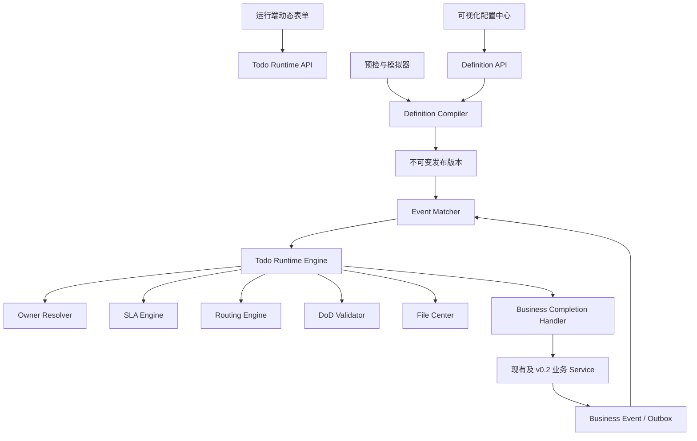

# v0.2 Foundation Design

## 1. 目标与结论

`v0.2-Foundation` 的目标是在正式开发 v0.2 业务功能前，补齐前端通用组件、后端通用能力、Todo Engine 可视化配置与运行时能力，并形成可自动验证的准入门禁。

本阶段采用“平台先行、业务后接”的两阶段方案：

1. Foundation 阶段实现通用平台能力，并为 PRD 的 TD-001～TD-025 建立完整、可校验、可追踪的定义包；
2. 正式 v0.2 阶段实现非诉、执行、案管分类等具体业务表、页面、业务处理器和最终业务链路。

Foundation 完成后，新增 v0.2 业务节点应以“配置模板 + 注册业务处理器 + 复用动态表单/文件/路由能力”为主，不再为每个模板重复开发一套前端弹窗、SLA 逻辑和下一节点逻辑。

## 2. 交付基线与范围

- 开发分支：`v0.2-Foundation`。
- 基线提交：`ea207d98`。
- 架构继续采用模块化单体，不引入微服务、消息队列或通用 BPM 产品。
- `law-todo` 负责定义、编译、运行、路由、SLA、审计和模拟。
- `law-file` 负责统一文件对象、版本、业务关联、权限与访问审计。
- `law-business` 与现有业务 Service 继续负责业务事实。
- `ruoyi-admin` 提供 API 和事务装配，`ruoyi-ui` 提供运行端和配置端页面。

### 2.1 Foundation 范围内

- Todo 定义文档、版本、校验、编译、发布、差异和回滚能力；
- 条件表达式、Owner、DoD、SLA、动态表单、路由图、循环、汇聚和受控自动动作；
- 事件目录、事件载荷 Schema、发布前预检和运行模拟；
- 动态表单渲染、材料清单、统一文件选择/上传、可视化配置中心；
- 现有 15 个技术模板的契约修复与兼容迁移；
- TD-001～TD-025 的定义清单、决策依赖、验收规则和配置草稿；
- 线索、客户、合同、财务、案件、事项详情中的统一待办摘要组件；
- 全量单元、集成、MySQL/Flyway、前端契约和 Playwright 测试门禁。

### 2.2 Foundation 范围外

- 非诉、执行、案管分类等尚不存在的具体业务表与业务页面；
- 未经 PRD 或业务负责人确认的 Owner、期限、收费、风险公式等业务决策；
- 为上述新业务模块编写最终 Completion Handler；
- Vue 3、微服务、MQ、BPM、全文检索、多租户和移动端改造。

范围外项目在正式 v0.2 阶段实现，但必须复用 Foundation 提供的定义、动态表单、文件、事件、路由与审计能力。

## 3. 准入现状与设计响应

| 领域 | 当前基础 | 主要缺口 | Foundation 设计响应 |
|---|---|---|---|
| Todo 运行端 | 领取、开始、提交、完成、退回、转派、取消、链路、附件、关系 | 表单按模板代码硬编码，材料与 DoD 不一致 | Schema 驱动的统一运行表单与服务端校验 |
| 配置中心 | 模板、版本、复制、草稿、发布的基础页面/API | Owner、DoD、SLA、触发、日历不可完整编辑；加载不回填 | 统一定义编辑器、双向序列化、预检、差异、模拟 |
| 事件 | Outbox、重试、DEAD、重放、幂等 | 条件仅支持扁平等值；无载荷 Schema | 事件目录、版本化 Schema、安全表达式树 |
| Owner | USER/ROLE/DEPT/POST/PAYLOAD | 无主管链、分案层级、轮询、休假跳过、兜底 | 可组合 Owner 策略和解析轨迹 |
| DoD | 必填字段、附件类型、业务 Validator | 字段与 UI 契约不统一，材料组合规则不足 | 统一字段注册表、材料规则、业务校验器注册表 |
| SLA | 工作日历、80%/100%/150% | 周期、暂停、阶段动作和模板化配置不足 | 版本化 SLA 策略与周期计划 |
| 路由 | 单一下一模板 | 无分支、循环、汇聚、默认动作 | 显式有向图、令牌、循环次数与汇聚规则 |
| 文件 | URL 和 Todo 附件 | 无统一对象权限、版本和下载审计 | 独立 `law-file` 模块及通用前端组件 |
| 延期与通知 | 管理员 SLA 豁免、站内定向通知 | 无正常延期申请审批；通知渠道直接耦合 | 延期工作流、通知模板与渠道适配器 |
| 业务嵌入 | 合同、案件、事项摘要 | 线索、客户、财务未统一 | 六类业务对象复用同一摘要/抽屉组件 |
| PRD 模板 | 15 个技术模板 | 与 25 个 PRD 模板非一一对应，无完整验收矩阵 | TD-001～TD-025 定义包与自动一致性门禁 |

## 4. 总体架构



核心约束：

- 业务 Service 只维护业务事实并写 Outbox，不直接创建下一待办；
- Todo 完成处理器只能调用公开业务 Service，不能直接调用业务 Mapper；
- 配置发布必须先通过编译和预检，运行时只读取已编译且不可变的版本；
- 历史实例保留定义快照，不因模板后续发布而变化；
- 表达式使用受限 AST，不使用 SpEL、脚本或数据库 SQL。

## 5. 版本化定义模型

### 5.1 规范文档

新增强类型 `TodoDefinitionDocument`，所有可配置项使用同一个带版本号的文档表达：

```json
{
  "schemaVersion": 1,
  "templateCode": "TD-001",
  "event": {},
  "owner": {},
  "dod": {},
  "sla": {},
  "ui": {},
  "routing": {},
  "autoActions": [],
  "decisionRefs": ["Q-001"],
  "acceptanceRefs": []
}
```

`todo_template_version` 新增：

- `definition_schema_version`：定义文档 Schema 版本；
- `definition_json`：草稿的规范文档；
- `compiled_json`：发布时生成的运行模型；
- `definition_hash`：规范化文档哈希；
- `validation_report_json`：最近一次预检结果；
- `published_by`、`published_time`：发布审计；
- `source_version_id`：复制/回滚来源。

现有 `owner_rule_json`、`dod_rule_json`、`sla_rule_json`、`next_rule_json` 和 `ui_schema_json` 在兼容期保留。迁移适配器把旧列转换成 `definition_json`；新代码只写规范文档，并在过渡期同步生成旧列投影。历史实例不做破坏性重写。

### 5.2 生命周期

- `DRAFT`：可编辑，可预检，不可触发运行实例；
- `BLOCKED`：结构合法，但依赖未决业务决策，不可发布；
- `PUBLISHED`：不可变，可触发新实例；
- `RETIRED`：停止新触发，历史实例继续按快照运行。

“回滚”不修改已发布版本，而是以历史版本为来源创建新草稿，重新预检并发布。

### 5.3 编译与发布

`TodoDefinitionCompiler` 执行：

1. JSON Schema 与字段类型校验；
2. 引用完整性校验；
3. 事件载荷字段和条件类型校验；
4. Owner 可解析性及兜底校验；
5. UI 字段、DoD 字段和材料规则一致性校验；
6. SLA 日历、阈值、暂停和周期校验；
7. 路由图可达性、死路、无界循环和汇聚校验；
8. 自动动作白名单和权限校验；
9. 未决业务决策阻断校验；
10. 生成规范化 `compiled_json` 与哈希。

只有零个 `ERROR` 且零个阻断型决策时允许发布；`WARNING` 需要发布人确认并写审计。

## 6. 规则能力设计

### 6.1 事件目录与条件表达式

新增事件目录，记录：

- `eventType`、`payloadVersion`、业务对象类型；
- 载荷 JSON Schema；
- 可用于 Owner、条件和表单默认值的字段；
- 生产者、示例载荷和弃用状态。

条件采用树形结构，支持 `AND`、`OR`、`NOT` 以及：

- `EQ`、`NE`、`IN`、`NOT_IN`；
- `GT`、`GTE`、`LT`、`LTE`；
- `EXISTS`、`EMPTY`、`NOT_EMPTY`；
- 字符串、数字、布尔、日期时间和枚举的类型化值。

字段路径只能引用事件 Schema 和受控运行上下文字段；发布时验证路径与类型，运行时禁止反射任意对象、SpEL 和脚本执行。

### 6.2 Owner 策略

统一 Owner 规则支持：

- 固定 `USER`、`ROLE`、`DEPT`、`POST`；
- 事件载荷字段 `PAYLOAD`；
- 业务对象负责人/主办律师；
- 直属主管与指定主管层级；
- 指定部门/角色候选池；
- 轮询分配；
- 案管分配层级；
- 跳过禁用、离职和有效请假人员；
- 委托代理与兜底规则。

Owner 解析返回主负责人、候选人、抄送人和完整解析轨迹。无法解析且无兜底时不创建匿名待办，事件进入可重试失败状态并暴露明确错误码。

### 6.3 DoD 与动态表单

DoD 使用稳定字段键而非页面中文名，支持：

- 必填、条件必填、格式、范围和枚举；
- 附件类型、最少/最多数量、任一/全部材料组合；
- 业务 Validator 注册表；
- 完成、退回、拒绝、转派等动作的不同规则；
- 字段与材料的版本化快照。

UI Schema 支持文本、长文本、数字、金额、日期、日期时间、单选、多选、字典、用户、部门、角色、业务对象、文件、材料清单和只读摘要字段。字段可配置默认值、提示、可见条件、禁用条件和布局。

服务端以 DoD 为最终准则；前端校验用于即时反馈，不能代替服务端校验。发布预检必须保证 DoD 引用的用户输入字段在 UI Schema 中存在，或明确标记为系统派生字段。

### 6.4 SLA 与周期

SLA 定义支持：

- 分钟、小时、自然日、工作日；
- 工作日历、节假日、工作时间段和时区；
- T0、T+1、T+2；
- 80%、100%、150% 阈值；
- 提醒、主管可见、升级、转派、回池等阈值动作；
- 等待客户/法院/第三方等受控暂停原因；
- 5 日、10 日、30 日及 5/15/30 工作日等周期计划；
- 合法延期、豁免与恢复计时的审计。

周期任务以稳定 `occurrenceKey` 幂等，配置必须有最大次数、结束条件或业务终止事件，禁止无界循环。

### 6.5 路由图

路由使用显式有向图：

- `TASK`：生成待办；
- `DECISION`：按条件选择分支；
- `FORK`：并行分支；
- `JOIN`：等待指定分支完成；
- `LOOP`：周期或条件循环；
- `END`：链路结束。

边可以配置条件、优先级和默认分支。实例保存路由版本、节点和令牌快照；下一节点幂等键包含根链路、路由节点、业务对象和循环序号。`JOIN` 明确配置 `ALL` 或 `ANY`，防止因部分分支缺失永久阻塞。

### 6.6 受控自动动作

只允许白名单动作，例如超时默认通过、默认退回、升级或回池。每个动作必须配置：

- 触发时间和前置条件；
- 业务处理器能力声明；
- 是否允许人工撤销；
- 系统服务身份；
- 通知对象和审计原因。

自动动作与人工动作使用同一 DoD、权限边界和业务事务，不允许绕过不可豁免的业务 Validator。

### 6.7 延期、通知与升级

正常业务延期与管理员异常豁免分开：

- 经办人可在规则允许时提交延期申请，填写原因、期望截止时间和证明材料；
- 审批 Owner、最大延期次数、最大时长和是否暂停当前 SLA 由模板配置；
- 审批通过后保留原截止时间、批准截止时间、申请人、审批人和理由；
- 管理员 SLA 豁免只用于异常处理，使用独立权限和审计，不替代正常审批；
- 重复申请、过期申请和并发审批使用 `actionId` 与状态条件更新保护。

新增 `TodoNotificationPort`，引擎只产生标准通知命令，由适配器发送站内信；短信、邮件、企业微信等后续渠道通过同一接口扩展。通知模板支持事件、阈值、动作、接收人策略和跳转链接，幂等键包含待办、接收人、通知类型、阈值或动作来源。

## 7. 运行时设计

### 7.1 实例快照

`todo_instance` 增加或固化以下快照：

- `definition_version_id`、`definition_hash`；
- `ui_schema_snapshot`、`dod_snapshot`、`sla_snapshot`；
- `route_node_key`、`route_token`、`occurrence_key`；
- `payload_schema_version`；
- 乐观锁版本。

运行时不回读可变草稿。发布版本停用或创建新版本均不改变历史实例。

### 7.2 动态完成流程

1. 运行端读取待办详情及 UI Schema；
2. 前端字段注册表渲染表单和材料清单；
3. 文件上传到统一文件中心并返回 `fileObjectId`；
4. 提交时携带 `actionId`、动作、字段值和文件对象；
5. 服务端执行 Schema、DoD、文件权限、状态和数据权限校验；
6. Completion Handler 与业务动作在同一事务执行；
7. 待办状态、动作日志、文件关联和业务 Outbox 一起提交；
8. 事件处理器或路由引擎幂等生成后续节点。

失败时待办和业务事实均不改变，前端保留用户输入并展示稳定业务错误码。

### 7.3 业务处理器注册

Completion Handler 通过 `templateCode/action` 或能力键注册，声明：

- 支持的业务对象和动作；
- 输入字段 Schema；
- 不可豁免校验；
- 可能产生的业务事件；
- 是否支持模拟。

Foundation 修复并注册现有业务链路处理器。正式 v0.2 为新增业务模块补充处理器，不需要修改通用运行页面。

## 8. 统一文件中心

新增 `law-file` Maven 模块，最小表结构：

- `file_object`：逻辑文件、存储键、哈希、大小、MIME、状态；
- `file_version`：版本号、存储键、上传人和变更说明；
- `file_business_relation`：业务类型、业务 ID、材料类型和可见范围；
- `file_access_log`：预览、下载、替换、删除和授权审计。

服务接口包含注册上传、完成上传、关联、创建新版本、预览授权、下载授权和撤销关联。先提供本地存储适配器，并保留对象存储 SPI；不在本阶段强制引入云服务。

权限按“功能权限 + 业务对象数据权限 + 文件关系可见范围”共同判断。前端和 API 不再以裸 URL 作为可信文件凭证；历史 URL 通过兼容适配器只读展示，并在后续业务操作中逐步迁移为文件对象。

## 9. 前端设计

### 9.1 运行端通用组件

新增或重构：

- `TodoDynamicForm`：按 UI Schema 渲染字段；
- `TodoFieldRegistry`：字段类型与组件注册表；
- `TodoMaterialChecklist`：DoD 材料清单和缺失提示；
- `BusinessFilePicker`：统一文件上传、选择、版本和权限提示；
- `TodoActionPanel`：完成、退回、拒绝、转派等统一动作；
- `BusinessTodoSummary`、`BusinessTodoDrawer`：六类业务页面统一嵌入。

`TodoActionDialogs.vue` 不再按模板代码分支。少量高度专业的业务控件通过字段注册机制扩展，而不是在总弹窗中增加 `if/else`。

### 9.2 可视化配置中心

配置编辑器包含：

1. 基本信息和业务决策引用；
2. 事件选择、载荷字段浏览和条件构建器；
3. Owner 策略、候选人、抄送和兜底；
4. 动态表单与 DoD 材料规则；
5. SLA、日历、阈值、暂停和周期；
6. 路由图、分支、循环与汇聚；
7. 自动动作；
8. JSON 只读预览、版本差异；
9. 预检报告、样例事件模拟和发布确认。

触发规则和工作日历由只读表格升级为完整增删改页面。编辑器加载已有草稿时必须完整回填，保存后重新打开的结构与原结构语义一致。

### 9.3 配置模拟器

管理员输入或选择样例事件后，模拟器展示：

- 条件匹配过程；
- Owner 解析轨迹；
- SLA 截止时间及三个阈值；
- 动态表单和 DoD；
- 可能的分支、循环和下一节点；
- 自动动作时间线；
- 阻断错误与警告。

模拟默认不写业务数据；集成测试模式可在隔离事务或专用测试数据中执行 Handler dry-run。

## 10. 现有模板契约修复

Foundation 必须修复已发现的不一致，并通过自动契约测试防止回归：

| 模板 | 当前问题 | 修复要求 |
|---|---|---|
| `LEAD_FIRST_CONTACT` | 后端要求 `CONTACT_PROOF`，UI 无对应上传；PRD 为 30 分钟但 SQL 为 60 分钟 | UI/DoD/附件统一，SLA 按已确认 PRD 配置 |
| `CONTRACT_REVIEW` | 后端字段 `auditResult`，UI/Handler 使用 `action` | 使用一个稳定字段键并兼容旧实例 |
| `CASE_TRANSFER_REVIEW` | 后端字段 `approvalResult`，UI/Handler 使用 `action` | 使用一个稳定字段键并兼容旧实例 |
| `CONTRACT_SIGN` | 后端要求 `SIGNED_CONTRACT`，UI 仅提交 URL | 使用文件对象和 Todo 附件关系 |

其余技术模板逐一执行 UI 字段、DoD、Handler 输入、附件类型、事件字段和 SLA 的六方一致性检查。

## 11. TD-001～TD-025 定义包与业务决策

每个 PRD 模板必须有一个机器可读定义清单和一行验收矩阵，至少包括：

- PRD 编号、名称、阶段和业务对象；
- 触发事件及载荷版本；
- Owner 规则及兜底；
- SLA、日历、周期和升级动作；
- UI 字段、DoD、材料与业务 Validator；
- 路由节点、条件、循环、汇聚和自动动作；
- 依赖的业务表、页面与 Completion Handler；
- Q-001～Q-012 决策引用；
- Foundation 状态与正式 v0.2 实现状态；
- 单元、集成和 E2E 验收用例 ID。

Foundation 可将依赖尚未实现业务模块的模板保存为结构完整的 `BLOCKED` 草稿。`BLOCKED` 表示平台与配置结构已经 ready，但缺少业务决策或业务处理器，不能误报为可投产。

新增业务决策登记表/资源，记录决策编号、问题、选项、负责人、状态、结论、影响模板和更新时间。发布预检遇到未解决的阻断决策时必须失败。PRD 已明确的默认值可以直接配置；PRD 未明确的内容不擅自补值。

## 12. API 设计

### 12.1 定义与发布

- `GET/POST/PUT /todo/definitions`
- `GET /todo/definitions/{id}/versions`
- `POST /todo/definitions/{id}/versions/{version}/copy`
- `POST /todo/definitions/{id}/preflight`
- `POST /todo/definitions/{id}/simulate`
- `POST /todo/definitions/{id}/publish`
- `POST /todo/definitions/{id}/rollback-draft`
- `GET /todo/definitions/versions/{left}/diff/{right}`

### 12.2 目录与配置资源

- `GET/POST/PUT /todo/event-catalog`
- `GET /todo/handler-catalog`
- `GET /todo/validator-catalog`
- `GET/POST/PUT /todo/calendars`
- `GET/POST/PUT /todo/decisions`
- `GET /todo/prd-template-matrix`

### 12.3 运行端

- `GET /todo/{id}/form`
- `POST /todo/{id}/actions/{action}`
- `GET /todo/{id}/definition-snapshot`
- `GET /todo/{id}/route`
- `POST /todo/{id}/extension-requests`
- `POST /todo/extension-requests/{id}/approve`
- `POST /todo/extension-requests/{id}/reject`
- `GET /todo/business/{type}/{id}/summary`
- `GET /todo/business/{type}/{id}/list`

### 12.4 文件

- `POST /files/register`
- `POST /files/{id}/complete`
- `POST /files/{id}/relations`
- `POST /files/{id}/versions`
- `GET /files/{id}/preview-token`
- `GET /files/{id}/download-token`
- `GET /files/{id}/versions`
- `GET /files/{id}/access-logs`

所有写接口使用强类型 DTO、Bean Validation、功能权限、数据权限、`actionId` 幂等和稳定业务错误码。

## 13. 数据迁移与兼容

- 所有数据库变化通过新增 Flyway 文件实施，已执行迁移永不修改；
- 新迁移先扩展表和兼容读写，再导入定义，最后启用新运行时；
- 旧模板 JSON 通过适配器转换和契约测试，不要求停机一次性重写全部历史数据；
- 新实例只使用发布定义的编译快照；旧实例继续按原快照完成；
- 文件 URL 历史记录保持只读兼容，新上传统一使用 `fileObjectId`；
- API 保留当前运行端入口，前端切换到新表单接口后再清理模板代码分支；
- 每个迁移具备从 v0.15/V0.17 基线升级和空库初始化测试。

## 14. 安全、权限与审计

- 配置、发布、模拟、文件访问和异常动作使用独立权限码；
- 配置人员不能通过表达式执行代码或访问未声明字段；
- 发布、回滚草稿、日历变更和决策变更写不可变审计；
- 自动动作使用明确的系统服务身份，并记录模板版本、规则和原因；
- 正常延期审批与管理员异常豁免使用不同权限、状态和审计记录；
- 通知渠道不直接接触 Todo 表，由端口传递最小必要数据；
- 文件预览/下载使用短期授权令牌，并记录用户、业务对象、IP、时间与动作；
- 运行端再次执行数据权限校验，不能依赖前端隐藏；
- Owner/候选池查询遵守部门和角色数据范围，防止通过配置枚举全组织人员。

## 15. 测试策略

所有新增行为遵循测试先行。

### 15.1 后端单元与契约测试

- 定义 JSON 解析、规范化、哈希与旧格式适配；
- 条件树每个操作符、空值、类型错误和非法路径；
- Owner 策略、离岗跳过、代理、轮询、主管链和兜底；
- DoD 字段、材料组合、业务 Validator 与动作差异；
- SLA 工作日、时区、80/100/150、暂停、延期和周期；
- 路由分支、并行、ANY/ALL 汇聚、有限循环和死路检测；
- 自动动作白名单、幂等、权限和事务回滚；
- 延期申请、审批、拒绝、并发、时限重算和异常豁免隔离；
- 通知命令幂等、接收人解析、渠道失败重试和敏感数据最小化；
- 25 个 PRD 定义清单完整性与阻断决策检查；
- 15 个现有模板的 UI/DoD/Handler/事件/SLA 契约一致性。

### 15.2 集成与数据库测试

- MySQL 上从基线执行全部 Flyway；
- 发布版本不可变、复制/回滚来源、并发发布；
- 事件重复消费、路由重复执行、周期 occurrence 幂等；
- Completion Handler 与业务事实/待办/文件关系事务一致性；
- 文件权限、版本和访问审计；
- Outbox 失败、重试、DEAD、人工重放与监控指标。

### 15.3 前端与 E2E

- 动态字段注册表和 Schema 渲染组件测试；
- 配置编辑器加载、编辑、保存、重开和 JSON 语义一致；
- 触发规则、日历、Owner、DoD、SLA、路由和自动动作可视化编辑；
- 预检错误定位、版本差异和模拟轨迹；
- Playwright 覆盖草稿复制、配置、预检、发布、触发、动态完成；
- Playwright 覆盖条件分支、有限循环、汇聚、超时动作和材料上传；
- 六类业务详情的待办摘要与链路抽屉；
- 前端生产构建和 UTF-8/契约静态门禁。

## 16. 两阶段实施计划

### 阶段一：通用能力 Ready

目标是让平台具备“定义—预检—发布—触发—动态处理—路由—审计”的完整闭环。

1. 定义文档、数据库扩展、旧模板适配器和编译器；
2. 事件目录、表达式、Owner、DoD、SLA 和决策登记；
3. 路由图、周期、汇聚、自动动作和运行时快照；
4. `law-file` 与通用文件组件；
5. 动态表单运行端和完整可视化配置中心；
6. 修复 15 个现有模板契约，补齐六类业务摘要；
7. 完成后端、前端、MySQL 和 Playwright 质量门禁。

### 阶段二：PRD 定义包与准入验收

目标是将 PRD 变成可开发、可追踪、可验证的正式 v0.2 输入。

1. 建立 TD-001～TD-025 机器可读定义与验收矩阵；
2. 将 PRD 已明确规则配置成可发布或可模拟版本；
3. 将依赖新业务模块或未决业务决策的模板标记为 `BLOCKED`，明确缺口；
4. 完成 25 模板预检、模拟和配置覆盖测试；
5. 输出 Foundation 验收报告、剩余业务开发清单和正式 v0.2 实施入口。

阶段二不把 `BLOCKED` 草稿伪装为已投产。只有业务决策完成且对应业务 Handler 在正式 v0.2 实现后，模板才转为可发布状态。

## 17. Definition of Done 与准入门禁

只有以下条件全部满足，才可宣布 `v0.2-Foundation` 完成：

1. Todo 运行表单不再按模板代码硬编码，现有模板全部走动态 Schema；
2. 配置中心可视化编辑事件、Owner、DoD、SLA、日历、路由、周期和自动动作，并可完整回填；
3. 定义可预检、模拟、发布、比较和生成回滚草稿，已发布版本不可变；
4. 后端可运行条件、分支、有限循环、ANY/ALL 汇聚和受控自动动作；
5. Owner 支持主管链、候选池、轮询、不可用人员跳过、代理和兜底；
6. 文件中心具备对象、关联、版本、权限和访问审计；
7. 正常延期申请/审批、异常豁免和通知适配器均可运行且审计边界清楚；
8. 15 个现有模板契约修复并通过自动一致性测试；
9. TD-001～TD-025 均有完整定义清单、决策依赖和验收用例；
10. 所有阻断型业务未决项在系统中明确登记，受影响模板不能误发布；
11. 线索、客户、合同、财务、案件、事项均复用统一待办摘要与链路组件；
12. Maven 全量测试、前端测试/构建、MySQL/Flyway 和 Playwright 全部通过；
13. CI 质量门禁绿色，形成带证据的 Foundation 验收报告。

正式 v0.2 业务开发的准入判定分为两层：

- **平台准入**：上述 13 项全部满足，可并行开发具体业务模块；
- **模板投产准入**：对应业务决策已确认、业务表/页面/Handler 已实现、模板 E2E 通过，才允许发布该模板。

这种双层判定避免“平台已经 ready”被误解为“25 个业务流程已经全部投产”。

## 18. 风险与控制

| 风险 | 控制措施 |
|---|---|
| 可视化设计器范围过大 | 只实现 PRD 所需节点和字段类型，不建设通用 BPM 产品 |
| 新旧模板并存导致行为不一致 | 旧格式适配、发布编译快照、15 模板契约门禁 |
| 动态表达式产生安全风险 | 受限 AST、Schema 字段白名单、禁止脚本/SpEL |
| 循环/汇聚导致重复或永久阻塞 | occurrence 幂等、最大次数、结束条件、图预检、令牌审计 |
| 业务未决项被技术默认值掩盖 | 决策登记与发布阻断，不擅自补充业务结论 |
| 文件中心改造影响历史附件 | 新旧双读、历史 URL 只读兼容、渐进迁移 |
| 同时重构前后端导致回归 | 垂直切片、TDD、每个切片保持全量门禁绿色 |

## 19. 明确不采用的方案

- 不继续为每个模板在 `TodoActionDialogs.vue` 添加硬编码分支；
- 不让管理员直接手写无约束 JSON 作为主要配置方式；
- 不用 Spring Event 代替事务型 Outbox；
- 不把 Todo Engine 等同于 BPM 审批引擎；
- 不在 Foundation 中提前虚构非诉、执行和案管分类的最终业务模型；
- 不为追求“25/25 已完成”而绕过未决业务决策和缺失的业务处理器。
