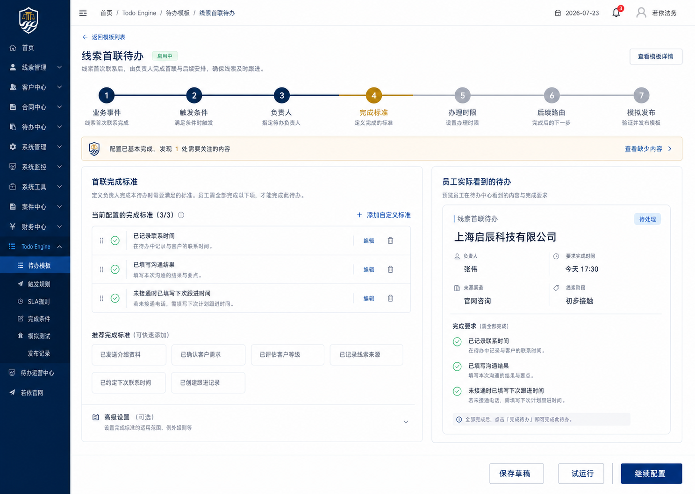

# Todo Engine 阶段二高保真与使用体验重构设计

**日期：** 2026-07-23

**代码基线：** `runtime/startup-wiring-fix` / `fea751dd994a7c1c1f13ab6658bed730d734ab53`

**产品范围：** Todo Engine 配置中心

**方案：** 方案 B——以配置任务旅程为中心重构

**视觉方向：** 用户选择的第二张视觉方案“业务旅程地图”

**视觉源：** [`assets/2026-07-23-todo-engine-phase-two-ux-selected.png`](assets/2026-07-23-todo-engine-phase-two-ux-selected.png)

**视觉源尺寸：** 1487×1058

**视觉源 SHA-256：** `4A0319D2B894856E90C2C5B00F6A00B926074682300D84C29B6C00724DFD0FBE`



## 1. 背景与结论

Todo Engine 的模板版本、Owner、DoD、SLA、触发、路由、Outbox、模拟和发布等核心后端能力已经具备，但现有配置中心仍以独立 CRUD 页面和技术字段为中心。业务管理员需要在多个菜单之间往返，无法顺畅完成“业务事件→触发条件→负责人→完成标准→办理时限→后续路由→模拟发布”的完整任务。

阶段二不重写 Todo Engine 运行内核。重构重点是：

1. 用一条业务配置旅程替代分散的技术页面。
2. 让事件、Payload、DoD、SLA、Owner 和路由具备上下文选择与维护能力。
3. 让业务管理员默认不接触 JSON、内部 ID、Java 类名和技术编码。
4. 让模拟测试从“可调用接口”升级为“可理解、可修复、可发布”的用户闭环。
5. 以用户选择的高保真视觉方案为唯一视觉目标，逐页完成同状态截图验收。

## 2. 完成定义

阶段二只有同时满足以下条件才算完成：

1. 普通业务管理员能在 10 分钟内完成一个简单模板的配置和模拟。
2. 所有启用事件都有可理解、可选择的 Payload 字段；空 Schema 有明确原因与修复入口。
3. 80% 以上常见 DoD 可通过推荐配方完成，不要求填写技术编码或 JSON。
4. 选择模拟对象后至少 90% 的 Payload 字段自动填充。
5. 模拟结果完整展示事件命中、Owner、DoD、SLA、路由和下一待办。
6. 配置阻塞项不可发布；警告项必须填写发布说明。
7. 员工端预览与实际待办表单的字段、材料和完成要求一致。
8. 原菜单地址、权限编码、已发布模板和不可变版本语义继续兼容。
9. 后端测试、真实 MySQL、前端测试与构建、Chrome E2E 和视觉 QA 全部通过。
10. 视觉 QA 中不存在 P0、P1、P2 差异；剩余 P3 只能是不会影响任务完成的小型润色。

## 3. 用户与权限

### 3.1 业务配置管理员

- 创建、复制和编辑模板草稿。
- 使用已经治理的事件、字段、配方、日历和路由资源。
- 选择业务对象并执行只读模拟。
- 查看配置问题，但不能维护受保护的技术能力。

### 3.2 资源管理员

- 维护事件草稿版本和 Payload Schema。
- 维护业务字段、材料、DoD 配方、工作日历和展示元数据。
- 查看资源引用关系。
- 不能在线上传或执行任意校验代码。

### 3.3 发布管理员

- 执行全量预检。
- 查看草稿与已发布版本差异。
- 填写发布说明并发布不可变版本。

### 3.4 审计人员

- 只读查看模板、资源、模拟记录、版本差异和发布记录。

校验器实现继续由受信任的 Java 注册机制控制。界面只治理中文元数据、参数 Schema、启用状态和绑定关系。

## 4. 信息架构

### 4.1 配置工作台

“待办模板”升级为配置工作台，首屏只显示对当前工作有帮助的信息：

- 业务场景和阶段。
- 配置进度。
- 阻塞问题和警告。
- 最近修改人和时间。
- 主操作“继续配置”或“查看已发布版本”。

取消重复的四张统计卡。筛选保留业务类型、阶段、状态和问题类型；技术编码作为辅助搜索，不作为主信息。

### 4.2 模板配置旅程

模板编辑使用固定七步横向旅程：

1. 业务事件。
2. 触发条件。
3. 负责人。
4. 完成标准。
5. 办理时限。
6. 后续路由。
7. 模拟发布。

每一步统一采用：

- 顶部旅程导航和完成状态。
- 左侧主编辑区。
- 右侧“员工实际看到的待办”或“即时检查”。
- 底部固定的保存、试运行和继续操作。

### 4.3 配置资源中心

统一管理：

- 事件与 Payload Schema。
- 业务字段。
- 材料类型。
- 校验器元数据。
- DoD 配方。
- 工作日历。
- 模拟对象数据源状态。

资源中心是高级入口。普通用户从当前步骤通过上下文抽屉维护资源，保存后返回原位置并刷新选项，不丢失草稿。

### 4.4 模拟实验室

提供跨模板和跨业务对象的只读模拟，支持：

- 搜索真实对象。
- 选择明确标识的只读样例对象。
- 查看 Payload 来源与覆盖值。
- 比较不同模板版本。
- 查看完整执行轨迹。

### 4.5 发布中心与运营中心

- 发布中心负责预检、差异、发布说明、发布结果和回滚指引。
- 运营中心负责运行异常、Outbox 失败、SLA 升级、异常关闭和人工重放。

旧的触发规则、DoD、SLA 等独立菜单保留兼容入口，但默认跳转到配置工作台或资源中心的对应上下文。

## 5. 视觉与交互规范

### 5.1 视觉语言

- 品牌主色：深海军蓝 `#0B2A55`。
- 强调色：克制使用的暖金 `#C89A3D`。
- 背景：白色与浅冷灰，不使用大面积渐变。
- 正文：14–16px 中文字体，正文行高不低于 1.5。
- 圆角：8–10px。
- 分组优先使用间距、对齐、字体层级和分隔线；阴影只用于浮层。
- 不使用卡片套卡片，不使用无业务意义的指标卡和装饰插图。
- 技术编码作为次要灰色信息；普通模式不展示 JSON。

### 5.2 配置状态

统一四种状态：

- `未开始`：中性灰。
- `配置中`：品牌蓝。
- `已完成`：绿色。
- `有警告`：暖金。
- `有阻塞`：红色。

页面同时显示步骤状态和整套模板状态。状态不能只依赖颜色，必须带图标和文字。

### 5.3 保存行为

- 表单字段失焦或完成一次结构性操作后触发防抖自动保存。
- 页面明确显示“正在保存、已保存、保存失败”。
- 保存失败保留本地编辑内容并允许重试。
- 离开页面时只在确有未保存变更时提示。
- 服务端使用乐观锁；发生版本冲突时展示差异，允许刷新合并或另存副本。

## 6. 七步旅程详细设计

### 6.1 业务事件

- 按业务类型、来源模块和状态搜索事件。
- 事件选项显示中文名称、产生时机、来源业务和版本状态。
- 选中后显示事件说明、示例对象和 Payload 摘要。
- Schema 不完整时阻止继续，并给出“维护事件字段”。

### 6.2 触发条件

- 字段显示中文名称、类型、示例值和来源。
- 运算符由字段类型限制。
- 值控件由字段 Schema 和字典类型生成。
- 支持条件组，但普通模式只允许两层组合。
- 右侧用自然语言说明规则何时命中及命中后会创建什么待办。

### 6.3 负责人

- 提供业务化策略：事件中的负责人、业务对象负责人、指定角色、指定人员、候选池。
- 显示解析顺序和回退策略。
- 使用当前模拟对象实时预览解析结果。
- 无回退且无法解析负责人时为发布阻塞项。

### 6.4 完成标准

- 默认展示按业务类型、业务动作和模板阶段匹配的推荐配方。
- 用户看到的是“已记录联系时间”等业务描述。
- 配方可以增删字段、材料和条件，但技术校验器编码只在高级设置展示。
- 右侧预览员工实际需要填写和上传的内容。
- 配方选择不会直接修改已发布模板，只更新当前草稿。

### 6.5 办理时限

- 使用自然语言配置时长、工作日历、起算时间和暂停规则。
- 用时间轴预览创建、80%、100% 和 150% 节点。
- 显示每个节点的提醒、升级、转派或回池动作。
- 无可用日历或时间计算失败时阻止发布。

### 6.6 后续路由

- 默认使用业务结果列表配置“完成后下一步”。
- 支持条件分支、结束、并行和汇合，但高级拓扑编辑器折叠在高级模式。
- 所有目标引用使用模板业务名称；技术模板编码作为次要信息。
- 检查无目标、循环无退出、无效版本和不可达分支。

### 6.7 模拟发布

- 选择真实业务对象或只读样例对象。
- 选择对象后由后端生成 Payload，并标记字段来源：对象读取、事件样例、系统默认、人工覆盖、仍缺失。
- 完整轨迹依次显示：事件命中、负责人解析、完成标准、SLA 截止、后续路由、待办预览。
- 模拟成功后才允许进入发布预检。
- 发布前重新从服务端执行全量预检，不信任页面缓存状态。

## 7. 前端组件边界

新增或重构为以下职责单一的组件：

- `TemplateConfigurationWorkbench`：模板与问题工作台。
- `TemplateJourneyShell`：七步旅程、统一保存和导航。
- `JourneyStepNav`：步骤状态和跳转控制。
- `EventStep`、`TriggerStep`、`OwnerStep`、`DodStep`、`SlaStep`、`RoutingStep`、`SimulationPublishStep`：独立步骤。
- `EmployeeTodoPreview`：员工端只读预览。
- `ConfigurationHealthPanel`：警告、阻塞和修复入口。
- `ContextResourceDrawer`：上下文资源维护与返回。
- `BusinessObjectPayloadEditor`：对象选择、Payload 来源和覆盖。
- `SimulationTrace`：统一执行轨迹。
- `PublishPreflightPanel`：发布门禁和说明。

各步骤只维护自己的表单状态，通过统一的草稿视图模型读写。步骤组件不直接访问其他步骤内部状态，也不自行推断发布资格。

## 8. 后端架构

保留现有：

- 不可变模板版本。
- `todo_event_catalog`。
- Owner 解析器。
- DoD 编译和校验器注册机制。
- SLA 与工作日历。
- 路由引擎。
- 模拟器。
- Outbox 和运行期处理。

新增面向页面的聚合应用服务 `TodoConfigurationJourneyService`，返回：

- 模板草稿摘要。
- 七步配置内容和状态。
- 当前步骤可用资源。
- 员工端预览模型。
- 警告和阻塞项。
- 当前用户允许的操作。
- 乐观锁版本。

后端步骤校验器负责统一计算状态。发布服务必须重新运行所有步骤校验并生成不可变快照。

## 9. 数据模型

### 9.1 事件资源

继续使用 `todo_event_catalog` 管理事件和版本。Payload JSON Schema 是机器事实，字段至少包含：

- 类型。
- 中文标题。
- 说明。
- 是否必填。
- 示例值。
- 字典类型或可选值。
- 来源说明。
- 是否敏感。

激活版本不可原地修改 Schema，只能创建新草稿版本。

### 9.2 校验器

继续使用 `todo_validator_metadata` 关联运行期 Java 能力。未注册或停用的校验器不能用于新发布，但历史版本继续可审计。

### 9.3 DoD 配方

继续使用 `todo_configuration_resource_item` 的 `DOD_RECIPE` 资源，不建立第二套配方表。扩展其 JSON 配置，明确：

- 适用业务类型。
- 适用业务动作。
- 适用模板阶段。
- 推荐优先级。
- 必填字段。
- 必备材料。
- 条件规则。
- 校验器引用。
- 员工端说明。

### 9.4 模拟对象适配

按业务类型注册后端适配器。适配器负责：

- 使用当前用户数据权限查询对象。
- 返回稳定摘要。
- 将对象转换为事件 Payload。
- 标记字段来源和缺失原因。

映射逻辑不放在 Vue 页面中。只读样例对象不能进入待办实例、关系或业务写接口。

### 9.5 草稿与发布

编辑继续写入现有模板草稿。资源目录的后续修改不会影响已发布版本；发布时将全部引用编译进不可变快照。

## 10. 数据流

```text
加载模板草稿
  → 聚合七步配置、资源、权限、预览和问题
  → 用户编辑当前步骤
  → 前端基础校验
  → 防抖保存草稿（乐观锁）
  → 后端重新计算步骤状态和员工端预览
  → 选择业务对象
  → 后端适配器生成并标注 Payload
  → 模拟器返回统一执行轨迹
  → 发布服务重新执行全量预检
  → 生成不可变版本快照
  → 写入发布审计
```

## 11. 错误处理与安全

- 资源加载失败只影响当前区域，保留草稿并提供局部重试。
- Schema 缺失说明缺少内容、受影响步骤和修复入口。
- 对象目录区分无匹配数据、无权限和数据源异常。
- 模拟错误使用稳定错误码并定位到具体步骤、字段和规则。
- 发布失败不产生半发布版本，完整保留预检报告。
- 错误主文案使用业务语言；请求 ID 和堆栈信息只在技术详情中显示。
- 资源写操作使用独立权限、操作 ID、乐观锁和审计日志。
- 敏感 Payload 字段在界面、日志和模拟记录中脱敏。

## 12. 兼容与迁移

- 不修改已发布模板版本。
- 不改变现有运行期事件消费语义。
- 旧配置页面路由保留并跳转到新上下文。
- 旧权限编码继续生效；新增资源维护和发布权限采用增量迁移。
- 现有草稿首次打开时由兼容层转换为旅程视图模型；保存时写回现有定义结构。
- 当前功能通过后再删除无调用的旧页面组件，不在第一批变更中直接移除。

## 13. 测试与设计 QA

### 13.1 后端

- 聚合视图、步骤状态和权限测试。
- Payload Schema 解析、字段类型和字典测试。
- 五类业务对象目录和 Payload 适配测试。
- DoD 配方匹配与编译测试。
- 模拟轨迹和错误定位测试。
- 草稿乐观锁、发布门禁和不可变快照测试。
- 真实 MySQL Flyway 和事务集成测试。

### 13.2 前端

- 七步导航、步骤状态和未保存保护。
- 自动保存成功、失败、重试和版本冲突。
- 事件字段、DoD 配方、对象选择和 Payload 来源。
- 员工端预览与健康检查。
- 模拟轨迹和发布预检。
- 旧路由和权限兼容。

### 13.3 Chrome E2E

至少覆盖：

1. 新建模板并完成七步配置。
2. Schema 缺失后从上下文维护并返回。
3. 使用推荐 DoD 配方。
4. 选择真实对象并自动填充 Payload。
5. 修复模拟失败后重新通过。
6. 发布阻塞、警告说明和成功发布。
7. 不同权限角色的可见与可操作范围。

### 13.4 视觉 QA

- 主基准视口为 1440×1024，补测 1920×1080。
- 使用用户选择的第二张视觉方案和同状态实现截图进行并排比较。
- 检查布局、间距、字体、颜色、边框、圆角、层级、溢出和交互状态。
- `design-qa.md` 只有在 P0、P1、P2 全部关闭后才能写 `final result: passed`。

## 14. 实施分批

### 批次一：旅程外壳与触发闭环

- 配置工作台。
- 七步旅程外壳。
- 聚合视图。
- 业务事件和触发条件。
- 上下文资源维护。
- 保存状态和健康检查。

### 批次二：Owner、DoD、SLA 与员工预览

- Owner 策略和解析预览。
- DoD 推荐配方。
- SLA 时间轴。
- 员工实际待办预览。

### 批次三：路由、模拟与发布

- 业务化路由。
- 对象 Payload 适配。
- 完整模拟轨迹。
- 发布预检和版本差异。

### 批次四：兼容、全量回归和视觉收口

- 旧路由和权限兼容。
- 全量自动化测试。
- 真实 MySQL 和 Chrome E2E。
- 1440×1024 与 1920×1080 视觉差异修复。
- 阶段二验收报告。

## 15. 非目标

本阶段不做：

- 重写 Todo Engine 运行内核。
- 迁移至 Vue 3。
- 建设任意拖拽低代码流程画布。
- 允许管理员在线执行脚本或上传 Java 类。
- 微服务拆分。
- 批量解除 v0.2 全部 25 个业务模板的业务依赖阻塞。

阶段二完成后，25 个业务模板将基于统一旅程和资源治理能力分批实现；阶段二本身交付的是可高效承载这些模板的生产级配置体验。
