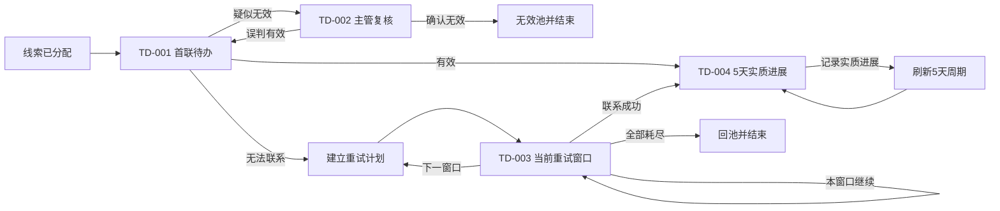

# 线索待办模板治理与五天进展循环设计

> 状态：已于 2026-07-31 经用户确认。采用“治理式发布包”，并将 TD-004 完成实质进展后自动开启下一轮五天周期纳入本次范围。

## 1. 目标

本次工作聚焦线索阶段四个待办模板的配置、发布和运行闭环：

- `TD-001` 首联待办；
- `TD-002` 疑似无效主管复核；
- `TD-003` 无法联系重试；
- `TD-004` 5 天实质进展待办。

完成后必须达到以下结果：

1. “线索首联”和“首联待办”不再形成两个可同时生效的入口；
2. TD-002、TD-003、TD-004 可以由业务用户通过七步向导完成配置、模拟和发布；
3. 业务字段、人员、部门和字典均显示中文业务含义，不以原始 ID 或英文代码作为主要展示；
4. 后续路由由受治理的业务结果生成，不要求用户填写任意字符串；
5. 模拟发布可以验证结束、保留当前待办、计划下一窗口和五天循环等真实语义；
6. TD-004 完成实质进展后写入线索跟进事实，并幂等生成下一轮 5 天待办；
7. 旧版本和历史待办继续可追溯、可完成，不修改已发布版本定义。

## 2. 需求依据与边界

需求依据为《待办事项驱动律所管理系统_整体需求 PRD_更新确认版_v0.2》及当前仓库实现。

PRD 对本范围的要求包括：

- 线索分配后生成首联待办；
- 疑似无效由主管复核，24 小时未处理按规则默认确认；
- 首联无法联系后按 T0、T+1、T+2 窗口重试；
- 首联有效后生成 5 天实质进展待办；
- 记录实质进展后刷新 5 天周期。

本次不实现 30 天无实质进展后的完整 TD-005 处置流程。TD-004 只负责“存在实质进展后刷新下一轮 5 天周期”；30 天规则继续作为后续模板的独立业务能力，不在 TD-004 中伪造跨阶段路由。

## 3. 仓库事实基线

### 3.1 重复首联模板

当前存在两个相同业务目的的模板：

- 历史模板 `LEAD_FIRST_CONTACT`，名称“线索首联”；
- 正式模板 `TD-001`，名称“首联待办”。

历史模板的入口触发规则已经停用；当前只有一条启用的 `LEAD_ASSIGNED -> TD-001` 规则。但是，现有数据库唯一键只约束事件、模板版本和业务类型的组合，不能阻止同一业务入口同时启用多个模板或多个版本。

当前启用规则绑定的 TD-001 版本也不是最新测试通过版本，因此不能把“存在一条启用规则”等同于“最新发布版本已经投产”。

### 3.2 三个草稿的主要问题

- TD-002：负责人来源、超时动作和路由未形成完整草稿；
- TD-003：草稿事件使用了错误的首联无法联系事件，只读重试上下文被当作完成条件，窗口配置无法通过通用 SLA 校验；
- TD-004：存在无业务意义的条件，并错误指向案件域的“律师接案确认”模板；
- 三者缺少完整的字段治理资源、完成条件配方和必要模拟场景；
- 配置查询会用已发布版本的哈希补齐空草稿哈希，可能让模拟证据与当前草稿不一致。

### 3.3 可复用基础

仓库已经具备以下能力，应直接扩展而不是另建并行引擎：

- 不可变模板版本和路由快照；
- 业务事件 Schema 和样例载荷；
- 受治理字段、材料、字典、校验器和配方目录；
- `todo_schedule_plan/window/occurrence` 调度计划；
- TD-002、TD-003 的业务完成处理器；
- 线索重试业务事实、重试计划和幂等记录；
- 模拟证据、发布预检和健康度计算；
- Todo 动作日志、附件和业务对象关联。

## 4. 方案选择

采用“治理式发布包”：字段语义、配置配方、模拟场景、运行处理器和版本激活必须作为一个协调版本投产。

不采用以下方案：

1. 仅通过 SQL 修复当前三个草稿：不能防止后续再次产生无意义字段、任意结果和重复入口；
2. 为线索流程硬编码专用配置页面：会使 Todo Engine 退化为线索专用功能，后续合同、案件和财务模板无法复用。

## 5. 目标业务流



TD-002、TD-003、TD-004 不建立独立的外部入口触发规则：

- TD-002 和首次 TD-004 由 TD-001 路由生成；
- TD-003 由持久化重试计划生成；
- 后续 TD-004 由持久化五天计划生成。

全链路只有 `LEAD_ASSIGNED` 是外部入口。

## 6. 模板生命周期和唯一激活

### 6.1 历史模板退役

- 将 `LEAD_FIRST_CONTACT` 标记为退役，不从默认可配置模板列表返回；
- 历史版本、实例、动作和审计记录全部保留；
- 已存在的历史实例继续由兼容处理器完成；
- 管理页面在“历史/退役模板”过滤器下展示替代关系：`LEAD_FIRST_CONTACT -> TD-001`。

### 6.2 唯一入口槽

为触发规则增加可空的 `entry_slot_code`。线索首联入口固定为：

```text
LEAD_FIRST_CONTACT_ENTRY
```

数据库增加仅对启用记录生效的唯一槽，应用服务同时执行事务内校验。激活新版本时必须：

1. 锁定入口槽；
2. 校验目标版本已发布且模拟证据匹配定义哈希；
3. 停用槽内旧规则；
4. 启用指向新版本的规则；
5. 写入版本激活审计；
6. 在同一事务提交。

模板状态和触发规则状态不可互相替代：模板发布表示版本不可变，入口槽激活才表示新业务实例采用该版本。

### 6.3 协调发布包

路由引用使用已发布的数字版本 ID，因此不能只发布下游模板后继续让 TD-001 指向旧版本。发布顺序固定为：

1. 发布修复后的 TD-002、TD-003、TD-004；
2. 从当前 TD-001 创建协调草稿，重新绑定三个下游已发布版本；
3. 运行 TD-001 与三个下游模板的必要模拟场景；
4. 发布新的 TD-001；
5. 原子切换 `LEAD_FIRST_CONTACT_ENTRY`；
6. 旧实例继续使用自身不可变路由快照。

## 7. 七步配置向导设计

### 7.1 第一步：业务事件

事件字段必须提供：

- 中文名称；
- 业务说明；
- JSON 类型；
- 语义类型，例如用户、部门、字典、业务对象或系统字段；
- 字典类型或实体解析器；
- 是否可作为负责人来源；
- 只读业务上下文标识。

主要字段如下：

| 模板 | 事件 | 业务字段 |
|---|---|---|
| TD-002 | `LEAD_SUSPECT_INVALID_MARKED` | 线索、复核记录、疑似无效原因、原负责人、复核主管、提交人 |
| TD-003 | `LEAD_RETRY_WINDOW_DUE` | 线索、重试计划、当前窗口、执行序号、线索负责人 |
| TD-004 | `LEAD_FIRST_CONTACT_VALID` | 线索、首联记录、线索负责人、首联操作人、首联结果 |

用户和部门字段以“名称 + 部门”展示，原始 ID 只在技术详情中展示；字典字段以中文标签展示，保存时仍使用稳定字典值。

### 7.2 第二步：触发条件

三个事件自身已经表达完整触发语义，默认不需要用户补充条件：

- TD-002：标记疑似无效即触发；
- TD-003：重试窗口到期即触发；
- TD-004：首联有效即触发首次任务。

页面显示“系统预设，无需附加条件”。内部常量条件可以存在于定义中，但不允许以 `undefined`、原始 ID 或无说明字段暴露给用户。

### 7.3 第三步：负责人

| 模板 | 负责人来源 | 用户文案 |
|---|---|---|
| TD-002 | 事件 `reviewerId` | 复核主管 |
| TD-003 | `BUSINESS_OWNER/LEAD` | 当前线索负责人 |
| TD-004 | 事件 `ownerId` | 当前线索负责人 |

向导切换步骤不能清空负责人配置。只有用户明确选择“更换负责人来源”并确认后，才覆盖原值。负责人预览必须显示姓名、部门、来源和不可用时的处理策略。

### 7.4 第四步：完成条件

普通用户优先选择受治理配方，技术字段和校验器只放入高级配置。

#### TD-002 主管复核配方

- `reviewResult`：复核结果，字典 `law_lead_invalid_review_result`，必填；
- `reviewOpinion`：复核意见，必填；
- 无材料要求。

#### TD-003 重试拨打配方

- `contactResult`：联系结果，字典 `law_retry_result`，必填；
- `CONTACT_PROOF`：每次拨号凭证至少一份；
- 选择“联系成功”时，姓名、城市、诉求、是否到所必填；
- `attemptStage`、`attemptCount` 是系统只读上下文，不属于完成条件；
- 保留 `LeadFirstContactValidator`，但页面展示中文能力说明。

#### TD-004 实质进展配方

- `progressType`：实质进展类型，字典 `law_lead_progress_type`，必填；
- `progressAt`：进展发生时间，必填；
- `FOLLOWUP_PROOF`：录音、截图、报价或外访凭证至少一份；
- `remark`：进展说明，选填。

TD-004 资源统一归入 `LEAD` 业务域；不得因为早期目录记录使用 `CUSTOMER` 而导致向导不可选择。

### 7.5 第五步：SLA 与调度

- TD-002：默认日历，1440 分钟；到期由受控服务账号完成“确认无效”，使用与人工相同的业务处理器和路由结果；
- TD-003：使用 T0、T+1、T+2 时间轴配方；页面显示每个窗口的开始、截止和最大尝试次数，不套用单一时长编辑器；
- TD-004：默认日历，7200 分钟；每次有效进展完成后，以 `progressAt` 为业务锚点创建下一周期。

### 7.6 第六步：业务结果和路由

业务结果来自字典或处理器契约，禁止自由文本。

| 模板 | 结果 | 引擎语义 |
|---|---|---|
| TD-002 | `TRUE_INVALID` 确认无效 | 进入无效池并结束 |
| TD-002 | `MISJUDGED_VALID` 误判有效 | 重新生成 TD-001 |
| TD-003 | `CONNECTED` 联系成功 | 生成 TD-004 |
| TD-003 | `CONTINUE_CURRENT_WINDOW` 本窗口继续 | 保留当前待办 |
| TD-003 | `NEXT_WINDOW` 进入下一窗口 | 当前待办结束，等待调度计划 |
| TD-003 | `EXHAUSTED` 全部重试耗尽 | 回池并结束 |
| TD-004 | `PROGRESS_RECORDED` 已记录实质进展 | 写入进展并计划下一 TD-004 |

路由目标目录必须按业务域和允许关系过滤。线索模板不能选择案件域的 `CASE_ACCEPT` 等目标。计划、结束、保留当前和循环应显示为系统动作卡片，不要求用户输入一个虚假的下游模板。

### 7.7 第七步：模拟与发布

模拟器必须支持以下预期效果：

- `NEXT_TEMPLATE`：生成指定模板；
- `END`：当前路径正常结束；
- `RETAIN_CURRENT`：当前待办保留；
- `SCHEDULE_NEXT`：当前待办完成并由调度计划生成后续任务；
- `SCHEDULE_SELF`：生成同模板的下一周期；
- `EXPECTED_VALIDATION_FAILURE`：负向校验场景按预期失败。

必要场景如下：

| 模板 | 必要场景 |
|---|---|
| TD-002 | 确认无效、误判有效、24 小时自动确认 |
| TD-003 | 联系成功、本窗口继续、进入下一窗口、全部耗尽 |
| TD-004 | 进展成功并生成下一周期、重复提交幂等、缺少凭证按预期失败 |

模拟证据必须绑定当前草稿自己的定义哈希。禁止通过 `coalesce(draftHash, publishedHash)` 把另一个版本的哈希展示为当前草稿哈希。定义改变后，旧模拟证据自动失效。

“返回修复”必须携带 `stepKey`、`resourceKey` 和错误上下文，定位到具体步骤和字段。页面展示中文问题和修复建议，同时在技术详情保留稳定错误码。

## 8. TD-004 五天循环运行时

### 8.1 新增应用服务

新增 `LeadProgressCycleService`，由 `LeadProgressHandoffTodoHandler` 调用。服务负责：

1. 根据 Todo 不可变上下文确定线索、负责人和模板版本；
2. 校验线索仍处于允许跟进的活动状态；
3. 校验进展类型、进展时间和凭证；
4. 写入线索跟进事实；
5. 创建下一轮五天调度计划；
6. 返回 `PROGRESS_RECORDED`、跟进记录 ID、计划 ID 和下一截止时间供路由与审计使用。

### 8.2 复用线索跟进表

保留 `biz_lead_followup`，通过前向迁移补充：

- `progress_at`：实际进展发生时间；
- `source_todo_id`：来源 TD-004；
- `schedule_plan_id`：下一周期计划；
- `idempotency_key`：稳定幂等键；
- 必要的唯一键和按线索、进展时间查询索引。

附件事实继续由 Todo 附件/材料关系保存，跟进记录通过 `source_todo_id` 追溯凭证，不复制文件。

### 8.3 调度计划

复用 `todo_schedule_plan/window/occurrence`：

- 每次 TD-004 完成创建一个单窗口计划；
- `startOffsetMinutes = 0`，使下一张 TD-004 立即物化；
- `durationMinutes = 7200`，截止时间为锚点后五天；
- 计划保存来源 Todo、业务对象、模板版本和策略快照；
- 下一任务的 `occurrenceKey` 由计划 ID、窗口代码和序号组成。

计划增加稳定幂等键，例如：

```text
LEAD_PROGRESS_5D:{leadId}:{sourceTodoId}
```

相同来源 Todo 的重复请求只能返回已有跟进记录和计划，不能重复生成下一待办。

### 8.4 事务与并发

一次完成操作中的以下动作必须处于同一事务边界：

- 写跟进事实；
- 写调度计划和窗口；
- 完成 Todo；
- 写动作审计。

物化器可以异步创建下一 Todo，但必须依赖已提交计划并使用唯一 occurrence key。失败计划按现有租约和重试机制恢复，不允许绕过唯一键直接补写 Todo。

## 9. 前端行为

### 9.1 字段显示

- 用户 ID：姓名、部门；
- 部门 ID：部门全称；
- 字典值：中文标签；
- 业务对象 ID：业务编号和名称；
- 原始字段名、ID 和代码放在“技术详情”折叠区。

### 9.2 预设和防误配

- 三个模板提供“一键应用推荐配置”；
- 系统管理字段默认只读；
- 负责人、完成条件、SLA 和业务路由分别显示配置摘要；
- 切换步骤保留未提交编辑状态；
- 业务域不匹配的路由目标不进入下拉目录；
- 当前生效模板和版本在模板列表、详情和发布页保持一致。

### 9.3 发布反馈

发布页按以下分组显示结果：

- 阻塞：必须修复后才能发布；
- 警告：允许发布但需要确认；
- 已通过：列出当前草稿哈希对应证据；
- 历史证据：只读展示，不计入当前健康度。

## 10. 迁移与发布策略

所有数据库变化使用新的前向 Flyway 迁移，不修改已执行迁移。

迁移负责：

1. 增加入口槽和唯一激活约束；
2. 标记历史首联模板退役；
3. 补齐事件 Schema 的中文语义；
4. 补齐 LEAD 域字段、材料、配方和场景资源；
5. 创建 TD-002、TD-003、TD-004 的新草稿，不修改已发布版本；
6. 增加 TD-004 跟进幂等字段和调度计划幂等约束；
7. 保留原入口规则，直到协调发布包全部通过。

不允许迁移在未经模拟的情况下直接把新规则切为启用。入口切换必须由发布应用服务完成。

## 11. 测试策略

### 11.1 单元测试

- 字段语义和实体解析；
- 配方应用和切换步骤不丢配置；
- 业务结果目录和跨域过滤；
- 草稿哈希与模拟证据一致性；
- 终止、保留、调度和自循环模拟语义；
- TD-004 跟进写回、五天计算和幂等重放；
- 唯一入口槽冲突。

### 11.2 MySQL 集成测试

- Flyway 从零迁移；
- 只有一个启用的首联入口槽；
- 旧实例不受退役影响；
- TD-002 三个场景的业务事实和路由；
- TD-003 四个场景的重试事实、计划和路由；
- TD-004 完成后只有一条跟进事实、一个计划和一张下一周期待办；
- 并发重复提交不产生重复数据；
- 协调发布后 TD-001 路由引用新的下游版本。

### 11.3 Playwright 验收

在真实前后端和 MySQL 环境中，对 TD-002、TD-003、TD-004 分别执行：

1. 加载推荐配置；
2. 检查七步中文字段和摘要；
3. 切换步骤确认配置不丢失；
4. 运行当前场景；
5. 运行全部必要场景；
6. 检查发布预检无阻塞；
7. 发布新版本；
8. 验证唯一入口和实际线索流转。

页面验收不能使用纯 Mock 结果替代真实 API、数据库事实和 Todo 实例。

## 12. 验收标准

本次工作只有同时满足以下条件才算完成：

- 默认模板列表只显示一个可用首联模板；
- 数据库对 `LEAD_FIRST_CONTACT_ENTRY` 保证最多一个启用绑定；
- 当前生效 TD-001 指向本次发布的 TD-002、TD-003、TD-004；
- 三个模板七步配置均无无意义“业务字段”、裸 ID、任意业务结果或 `undefined`；
- 三个模板全部必要模拟场景通过，健康度基于当前定义哈希；
- 发布预检无阻塞，返回修复能够准确定位；
- TD-002 人工与超时自动复核均执行真实业务写回；
- TD-003 能保留当前窗口、进入下一窗口、联系成功或耗尽回池；
- TD-004 写入实质进展并幂等生成下一轮 5 天待办；
- 后端、前端、Flyway、MySQL 集成测试和 Playwright 验收全部通过；
- 已发布旧版本和历史待办保持可追溯、可完成。

## 13. 回滚原则

- 入口切换失败时，事务回滚到旧入口绑定；
- 已发布版本不删除、不覆盖；
- 新版本运行异常时只能重新激活上一已发布版本，不能修改历史定义；
- 已创建的新周期计划通过业务化取消动作停止，不直接删除；
- 数据迁移只允许前向补偿，不回写或改动旧迁移文件。
